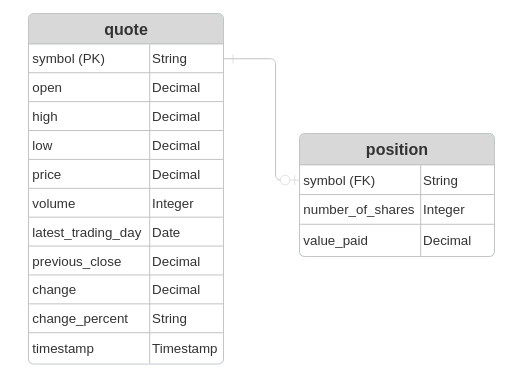

# Introduction

This Stockquote app is a CLI application that allows users to view, buy, and sell real-time stock quotes from AlphaVantageAPI to manage their stock portfolio.
Updated quote data, buys, and sells are managed with a PostgresSQL database for persistent data in multiple sessions.

This app was built with Java 11 with JDBC+PostgresSQL for database access, Maven for software packaging and dependency management, OkHttp3 for http requests, Jackson for JSON processing, SLF4j and Reload4j for logging, and Docker for deployment.
Testing was performed with Junit and Mockito for Unit/Integration testing and mock testing.

# Quick Start
> [!NOTE]
> Requires Docker
> psql_docker.sh and ddl.sql are not required, but are recommended for easy setup.

## To Set Up the Database
Download the utilities folder from the repository.
It should contain ddl.sql and psql_docker.sh.

Run the setup commands inside the utilities folder.

Use the following command to create a docker container `jrvs-psql` for the PostgreSQL database with your wanted username and password:
```
psql_docker.sh create <user> <password>
```
This script automatically runs ddl.sql to set up the quote and position tables.psql_docker.sh create user password

use the following commands to start/stop the `jrvs-psql` container from the script:
```
psql_docker.sh start
```

```
psql_docker.sh stop
```

## To Run the App Container
> [!NOTE]
> Requires the database to be setup to run
> Remember to replace the username, password, api-key values for your setup

Pull the docker image from docker hub.

```
docker pull phiqw/stockquote:latest
```

Use the following command to run an app container with the required environment variables:
```
docker run -it --rm \
-e db-host=localhost \
-e db-name=stock_quote \
-e db-port=5432 \
-e db-user=user \
-e db-password=password \
-e api-key=#YOUR-ALPHA-VANTAGE-KEY# \
--network host \
phiqw/stockquote:latest
```

# Implementation
## ER Diagram


This is the architecture for the database. There are quotes and positions, where quotes keep the information of each stock quote, while the position keeps track of the user's trading profile.

## Design Patterns
This project implemented the Data Access Object pattern to abstract querying and database operations from internal data use.
In the DAO layer, you can see that Data Access Classes QuoteDao and PositionDao have methods that implement common database functions like save(), findByID(), and deleteAll() so that the business logic on top can access and manipulate persistent data without having to go into specific database access complexities.

In the Service Layer, you can see the Repository pattern abstracting business logic and data storage.
In the PositionService class, business operations like buy(), sell(), and viewProfile() lay on top of the data layer from the Data Access Objects to perform higher level, business related tasks.

# Test
This application was tested with JUnit 5 and Mockito.

Unit testing was performed with mocks to allow consistent function testing without changes due to the api or network connection.
The different layers were tested with mocks to allow unit testing without specific class instances. For example, when testing the QuoteHttpHelper, mocks were used to simulate responses from the AlphaVantageAPI to allow testing functions without needing an api key or connectivity.

Integration tests were used with a live PostgreSQL database running in docker. This allowed for testing between the DAO layer and Service layer to ensure that they still functioned in conjunction with one another beyond individual unit tests.
