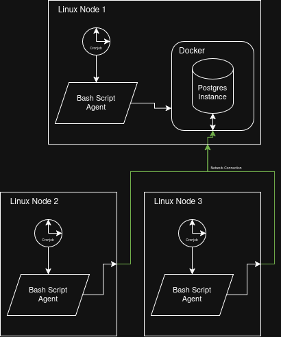

# Linux Cluster Monitoring Agent
This tool is designed for Linux administrators to record and view the real-time and historical hardware specifications and usage data of their monitored nodes within a Linux cluster.

This project uses bash scripting to pull and process hardware/usage data, a Dockerized instance of Postgres as an RDBMS, and PSQL to build and insert data within the data tables.

The database only needs to run on one node, as other nodes in the cluster can simply connect to the database instance, provided that network rules are set up correctly. An example of this can be seen in the [Architecture](#Architecture) section below.

# Quick Start
> [!NOTE]
> Ensure the parts of the script within <> are configured to your setup

Create a psql instance with `psql_docker.sh`[^1]
```
./scripts/psql_docker.sh create <db_username> <db_password>
```

Generate the tables with the `ddl.sql`
```
psql -h localhost -U <db_username> -d host_agent -f ./sql/ddl.sql
```

Insert the Hardware Specifications into the database with `host_info.sh`[^2]
```
./scripts/host_info.sh localhost 5432 host_agent <db_username> <db_password>
```

Insert the Usage Data into the database with `host_usage.sh`
```
./scripts/host_usage.sh localhost 5432 host_agent <db_username> <db_password>
```

Open the crontab to automate running the `host_usage.sh` script
```
crontab -e
```

Insert the cron job below and save the file[^3]
```
* * * * * bash /<path_from_root>/linux_sql/scripts/host_usage.sh localhost 5432 host_agent <db_username> <db_password> > /tmp/host_usage.log
```

You can check that the crontab was saved with:
```
crontab -l
```

[^1]: '.' refers to the project's root folder.

[^2]: Change localhost and port to connect to the RDBMS when the node is not hosting the database

[^3]: `/tmp/host_usage.log` logs the script's output after each run

# Implementation
## Architecture


In the example architecture, one node is running the Dockerized Postgres instance, and every node connects to that database through the network (or localhost if it's running the RDBMS) to push their hardware/usage data.

## Scripts
### psql_docker.sh
This script is used to create, start, and stop the Docker database instance.

The username and password must be passed to the other scripts for database access.
```
# creates a Docker database container with the given username and password if it has not been created already
./script/psql_docker.sh create <db_username> <db_password>

# starts the database container if it exists
./script/psql_docker.sh start

# stops the database container if it exists
./script/psql_docker.sh stop

```

### host_info.sh
> [!NOTE]
> If you are running the RDBMS on the same machine, you can use 'localhost' for the host address and '5432' for the port.

This script is used to collect the hardware specifications of the host and put it into the `host_info` table. 

This script can be called manually and is intended to run once for each node.

`host_agent` is the database name
```
./scripts/host_info.sh <host> <port> host_agent <db_username> <db_password>

# example
./scripts/host_info.sh localhost 5432 host_agent bob password123
```

### host_usage.sh 
This script is used to collect usage data from the node machine and insert it into the `host_usage` table.

This script can be called manually, and it also runs as a cron job every minute to collect real-time data.
```
./scripts/host_info.sh <host> <port> host_agent <db_username> <db_password>
```

### crontab
In [Quick Start](#quick-start), `host_usage` is put into the crontab with the job below, with `crontab -e`

This job runs the host_usage script every minute and sends the output to the log file.
```
* * * * * bash /<path_from_root>/linux_sql/scripts/host_usage.sh <host> <port> host_agent <db_username> <db_password> > /tmp/host_usage.log
```

## Database Modeling
The `host_agent` database in the RDBMS has 2 tables:

`host_info` contains one hardware specification entry for each node in the cluster

`host_usage` contains one usage data entry every minute for real-time usage tracking

### host_info schema
- `id` An auto-incrementing primary key for each node
- `hostname` The FQDN (Fully Qualified Domain Name) of the node, and each entry is unique
- `cpu_number` The integer number of CPUs on the machine (example: a 4 core cpu would be '4')
- `cpu_architecture` Architecture of the CPU (example 'x86_64')
- `cpu_model` The full name of the CPU model
- `cpu_mhz` Float for the clock speed of the CPU in MHz
- `l2_cache` the amount of l2 cache in KiB
- `"timestamp"` A timestamp in the format "YYYY-mm-DD HH-MM-SS" from when the data was taken
- `total_mem` The total available memory in kilobyte blocks for the host machine

### host_usage schema
- `"timestamp"` A Timestamp in the format "YYYY-mm-DD HH-MM-SS" from when the data was taken
- `host_id` The `id` of the host machine from the `host_info` table (matching id required)
- `memory_free` The amount of idle memory in megabytes
- `cpu_idle` The total percentage of the CPU time spent idle
- `cpu_kernel` Time percentage spent running kernel code
- `disk_io` The current amount of i/o in progress in megabytes
- `disk_available` Total megabytes of data available on the entire disk

# Tests
At the moment, the functionality can be tested manually to ensure that the scripts run as wanted.

The bash scripts can be run with `bash -x ...` to get a more detailed trace of the program:
```
bash -x ./scripts/<script>.sh ...args...
```

host_info.sh and host_usage.sh output to the database so you can use the psql CLI tool to check that the data entered the database correctly.

You can test the `dll.sql` by entering the psql instance with the CLI tool, switching to the databases with `\c host_agent`, and using `\dt` to check that the tables exist.

# Deployment
This project can be pulled off GitHub with Git, to be run on your local or remote machines.

Docker is required to run the Postgres RDBMS.

Further, PostgreSQL itself is required to run the bash scripts.

See [Quick Start](#quick-start) to set up the database, scripts, and automate collecting the usage data.

# Improvements
## Setup script
Creating a setup script to automate the deployment for monitoring agents would reduce the work of running the scripts manually. This project was intended for use on ~10 remote clusters, but if you needed to set it up on 100+ devices, it would save time and energy to make this process more automated.

## Enhanced Logging
Creating a more thorough logger would make it easier to debug issues that may show up while the program runs. For example, if errors occur like a cluster being unable to connect to a database, it would be easier to diagnose what the error was and when it started.

## Data Reports
Setting up database queries to generate reports would make it easier for Admins to view and analyze the data collected by the clusters. Reports on cpu idle time and disk space remaining could help in decision-making for expanding or scaling back clusters.